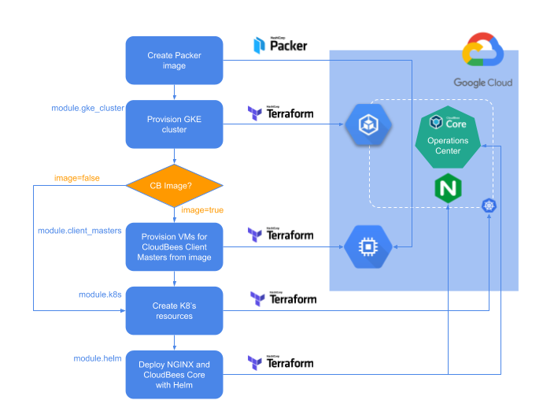

# Deploying a Hybrid CloudBees Core on GKE with Terraform

The content of this repo shows all configuration needed to provision infrastructure and deploy CloudBees Core on GCP (GKE and GCE) using [Terraform](https://terraform.io). In this repo you will find different `.tf` scripts, folders and other sources which contains the following:
* [Packer]() image creation definition (`client-master.json`) to provide a GCP image with CloudBees Core Client Master instance installed
* Terraform module (`module.gke_cluster`) to create GKE cluster where [CloudBees Core]() and the [Operations Center]() will be deployed
* Terraform module (`module.client_masters`) to create GCP resources to provision [Client Master]() instances
* Terraform module to create Kubernetes resources, like required namespaces for CloudBees Core components and NGINX Ingress controller requirements (Tiller `serviceAccount` and `roleBindings`)
* Terraform module (`module.helm`) to install helm charts to deploy [NGINX Ingress controller]() and [CloudBees Core for modern platforms]()
* Terraform scripts to provision and deploy everything according to parameters and configurations

The workflow and architecture of the Terraform project can be shown in the following picture



## Structure of this repo

All resources needed to deploy the Terraform project are structured like this:

```
cloudbees-core (folder with main Terraform project)
|__ main.tf (Terraform script to deploy)
|__ out.tf (Outputs parameters to be shown at the end)
|__ providers.tf (Providers used in main deployment)
|__ vars.tf (Default parameters values to use)

modules (folder with Terraform modules used by project)
|
|__ gcp_cm (module to create Master Client VMs on GCP)
|   |__ main.tf (Terraform definition of the module)
|   |__ outputs.tf (output values of the module)
|   |__ variables.tf (input parameters of the module)
|
|__ gke-cjoc_mm (module to create GKE cluster for CloudBees Core)
|   |__ main.tf (Terraform definition of the module)
|   |__ outputs.tf (output values of the module)
|   |__ variables.tf (input parameters of the module)
|
|__ helm (module to install CloudBees Core and NGINX ingress controller by using Helm)
|   |__ main.tf (Terraform definition of the module)
|   |__ variables.tf (input parameters of the module)
|
|__ k8s (module to configure Kubernetes cluster)
|   |__ main.tf (Terraform definition of the module)
|   |__ outputs.tf (output values of the module)
|   |__ variables.tf (input parameters of the module)
|
|__ Packer (folder with the Packer definition for a Clien Master image)
    |__ client-master.json (Packer file with image build definition)
    |__ README.md (guide to use Packer to build and publish the image in GCP)
    |__ update-cm.sh (script used by Packer to install Cliente Master in the image)
```

